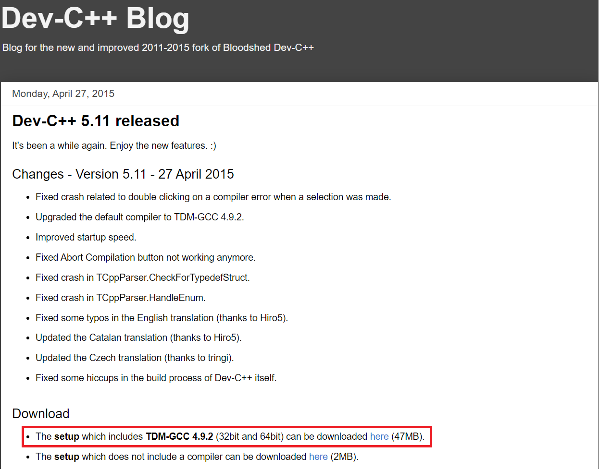
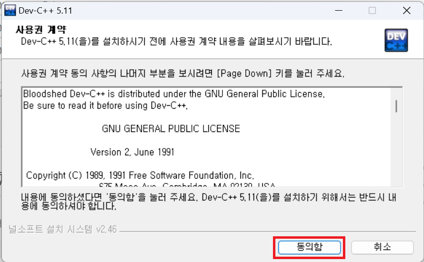
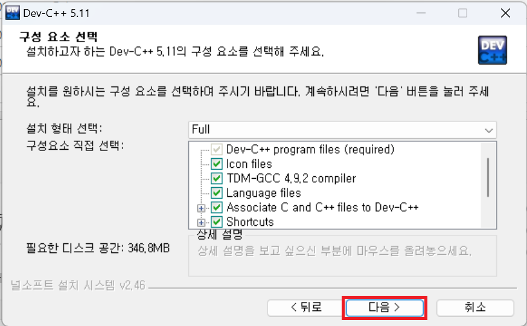
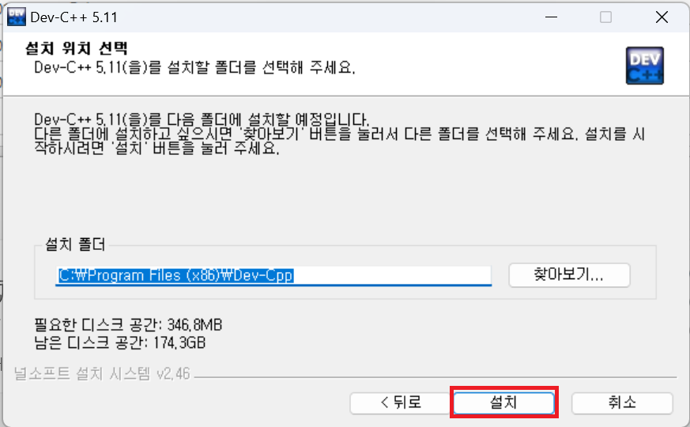
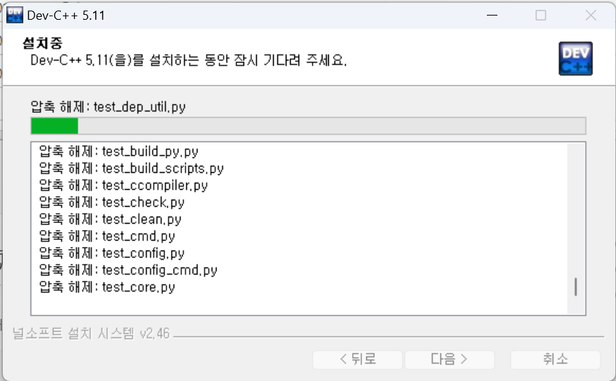
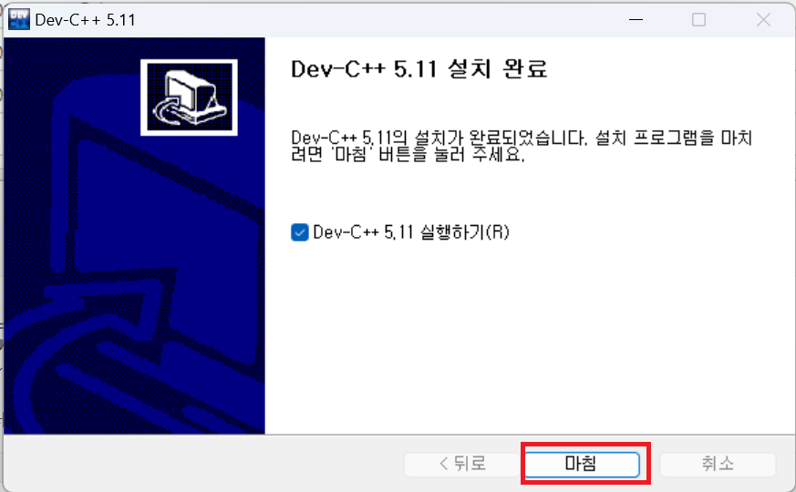
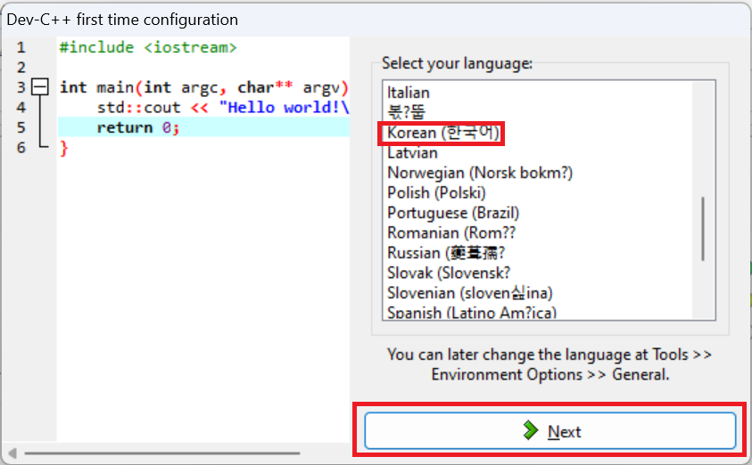
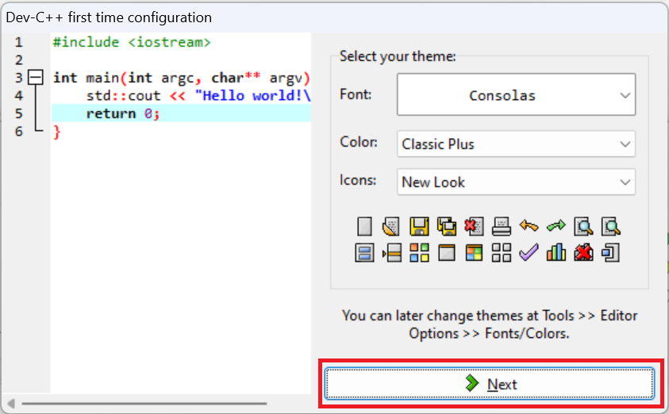
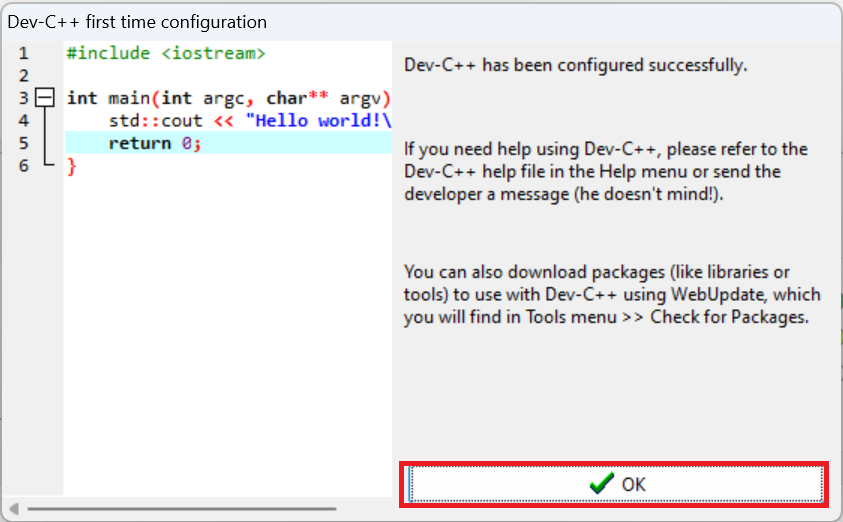
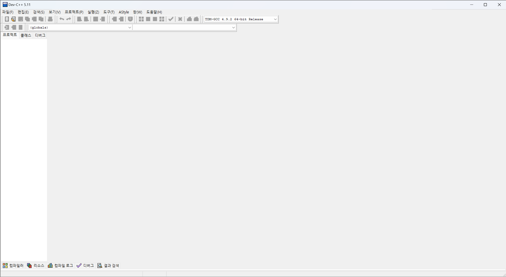

# Dev-C++ 5.11 설치 매뉴얼

Dev-C++은 C와 C++ 언어를 위한 무료 소스 코드 편집기이자 IDE(Integrated Development Environment)입니다. Dev-C++은 TDM-GCC 컴파일러를 포함하고 있어, Windows에서 C/C++ 프로그램을 개발하고 컴파일할 수 있습니다. 본 매뉴얼은 Dev-C++ 5.11 버전을 설치하는 과정을 안내합니다.

## 설치 준비

1. Dev-C++ 5.11을 다운로드합니다. 이 버전은 TDM-GCC 4.9.2를 포함하고 있어 추가적인 컴파일러 설치 없이 C/C++ 개발이 가능합니다.

   

## 설치 과정

2. 다운로드한 설치 파일을 실행한 후, '동의함(Agree)'을 클릭하여 라이선스 조건에 동의합니다.

   

3. 설치 유형 선택에서 '전체설치(Full)' 옵션을 선택한 상태로 '다음(Next)' 버튼을 클릭합니다.

   

4. 설치 위치를 선택하는 단계에서는 기본값을 유지한 채 '설치(Install)' 버튼을 클릭하여 설치를 시작합니다.

   

5. 설치가 진행되는 동안 설치 상태를 확인할 수 있습니다.

   

6. 설치가 완료되면 '마침(Finish)' 버튼을 클릭하여 설치 마법사를 종료합니다.

   

## 초기 설정

7. 처음 Dev-C++을 실행하면 언어 선택 화면이 나타납니다. 여기서 '한국어'를 선택한 후 'Next' 버튼을 클릭합니다.

   

8. 폰트 및 색상 설정 화면에서는 기본 설정을 유지하고 'Next' 버튼을 클릭합니다.

   

9. 마지막으로 'OK' 버튼을 클릭하여 초기 설정을 완료합니다.

   

이제 Dev-C++ 5.11 설치 및 초기 설정이 완료되었습니다. Dev-C++을 사용하여 C 및 C++ 프로그램 개발을 시작할 수 있습니다.

